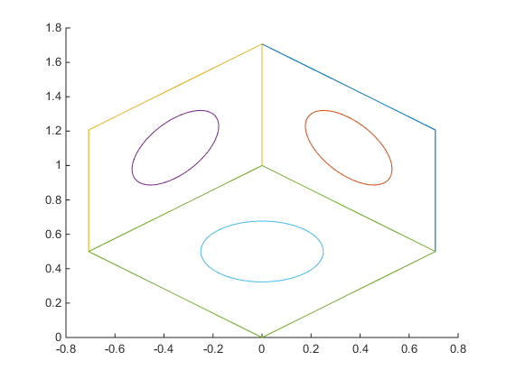
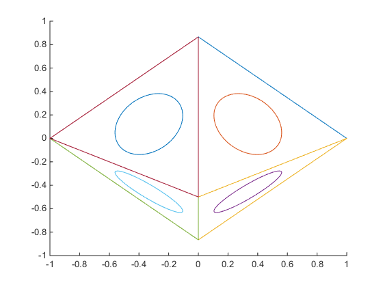

# Rotate-find-face

<h1>Cube Faces</h1>
<figure style="text-align: center;">
    
    <figcaption>Figure 1. Cube</figcaption>
</figure>

<h1>Cube Faces</h1>
<figure style="text-align: center;">
    
    <figcaption>Figure 2. Frustum</figcaption>
</figure>

<h1>Cube Faces</h1>
<figure style="text-align: center;">
    
    <figcaption>Figure 3. Cctahedron</figcaption>
</figure>

<h1>Cube Faces</h1>
<figure style="text-align: center;">
    
    <figcaption>Figure 4. Pyramid</figcaption>
</figure>
